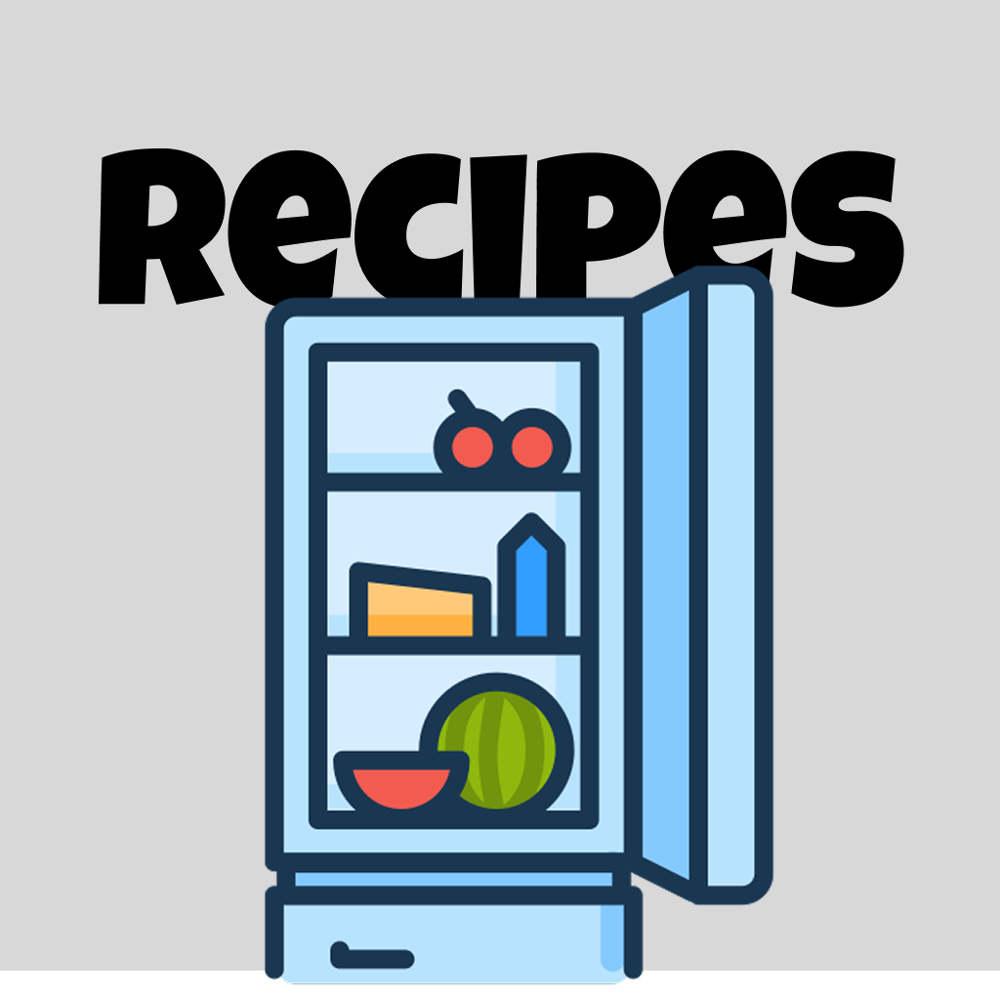

<p align="center">
  
</p>

<h1 align="center">RecipePlanner</h1>

<p align="center">An iOS app that keeps track of the groceries you have at home and finds recipes you can cook with them.</p>

## Features

- **Recipes** — your own cookbook: create, edit and favourite recipes, search by name
- **Find** — enter what's in your fridge and get matching recipes from the [Spoonacular API](https://spoonacular.com/food-api), ranked by how many of your ingredients they use; save any result to your cookbook
- **Inventory** — track groceries with stock counts and expiry dates, sorted so the ones that go off first are on top
- **Settings** — enter your Spoonacular API key and reset the app's data
- Everything is stored locally with **SwiftData**; full **Dark Mode** support using system colours

## Tech stack

- SwiftUI, SwiftData, Swift concurrency (`async/await`)
- [Kingfisher](https://github.com/onevcat/Kingfisher) for loading recipe images
- [Swift Collections](https://github.com/apple/swift-collections)
- Project generated with [XcodeGen](https://github.com/yonaskolb/XcodeGen) (`project.yml`)

## Getting started

Requirements: Xcode 16+ and iOS 18.

```bash
git clone https://github.com/KartikKrishnan05/RecipePlanner.git
cd RecipePlanner
open RecipePlanner.xcodeproj
```

Run on a simulator or device. To use the **Find** tab, get a free API key at [spoonacular.com/food-api](https://spoonacular.com/food-api) and paste it under **Settings**.

To build on a physical device, change the development team in `project.yml` (or under *Signing & Capabilities*) to your own.

## Project structure

```
RecipePlanner/
├── RecipePlannerApp.swift     app entry, SwiftData container
├── ContentView.swift          tab bar: Recipes / Find / Inventory / Settings
├── Models/                    Recipe, Grocery (SwiftData), sample data
│   └── APIHelper/             Spoonacular client and response types
├── Views/                     the four main tabs
├── DetailViews/               detail and edit screens per tab
└── Buttons/                   reusable UI components
```

## Documentation

This app was built for an iOS development course. The course write-up — problem statement, user stories, quality attributes, UML class diagram and notes on responsible AI use — is in [`docs/COURSE_DOCUMENTATION.md`](docs/COURSE_DOCUMENTATION.md).
