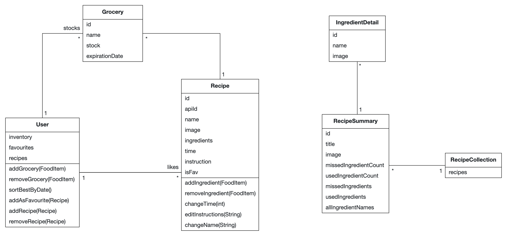

# RecipePlanner — Course Documentation

Project documentation written for the iOS intro course this app was built in.

### Problem Statement (max. 500 words)

As a person who tends to cook alone, I tend to lose the overview of what to cook. Remembering everything I have in stock and also finding a recipe for which I have all the ingredients is a difficult task. Also, finding new recipes according to my groceries at home is never an easy task.

The application should have lots of recipes and should let me favorite recipes I like to make often. It should have the possibility to filter regarding ingredients. I should also be able to add new recipes of my own.

I need an app which tracks all the groceries I have and remembers when to buy replenishment. I don't want to waste or buy new groceries even though I already have them at home. 


### Requirements

#### Functional Requirements (User Stories)

- As a home cook, I want to be able to find recipes according to the groceries I have so that I don't have to waste time finding them.
- As a user, I want to be able to view all the recipes so that I don't have to remember them by heart.
- As a user, I want the application to track remaining groceries with their respected stock so that I have a better overview. 
- As a home cook, I want to be able to sort all groceries I have by their respective due dates so that I don't forget about them.
- As a user, I want to create new recipies so I can come up with my own creations. 
- As a home cook, I want to be able to improve and rewrite recipes so that I can change them to my liking 


#### Quality Attributes & External Constraints

HIG usability: 
- Primary navigation uses a TabView in ContentView.swift. 
- Action buttons are made prominent and accessible using the reusable CircleButton component. 
- Search functionality is implemented using the built-in .searchable modifier across container views (RecipeView.swift, InventoryView.swift). 
- Custom titles are implemented via .toolbar for a stylized, consistent look.

Dark mode: 
- The application achieves full Dark Mode compatibility automatically by relying exclusively on system-provided semantic colors and system material backgrounds
- Supporting Evidence:
    - Dynamic Backgrounds: RecipeCellView.swift and GroceryCellView.swift (use Color(.systemGray5) for cell background).
    - Text and Icon Colors: All text uses default Text coloring or Color.secondary, which automatically inverts. Icons in CircleButton.swift use foregroundColor(.white) over a colored background, which provides sufficient contrast in both modes.

Responsivness: 
- The application's layout is designed to be largely responsive and adapts well to various iPhone screen sizes using core SwiftUI layout containers and modifiers
- Supporting Evidence: 
    - Flexible Layouts: Implemented in most views (e.g., ContentView.swift, SettingsView.swift) using VStack and HStack.
    - Full Width Adaptation: ResetButtonView.swift (uses .frame(maxWidth: .infinity)).
    - System Navigation: NavigationStack usage across all main views ensures system-level responsiveness and title handling.

Persistence: 
- The application uses SwiftData to ensure the core data models (Recipe and Grocery) are saved locally across sessions.
- Supporting Evidence:
    - Data Definition: Recipe.swift, Grocery.swift
    - Configuration: RecipePlannerApp.swift
    - Data Access: RecipeView.swift, InventoryView.swift
    - Management: SampleData.swift (for test environments)

Logging: 
- Diagnostic logging is implemented across critical operations to record success, failure, and state changes, aiding in development and debugging.
- Supporting Evidence: 
    - RecipeCollectionFetcher.swift and SettingsView.swift

Error handling: 
- The central networking class, RecipeCollectionFetcher.swift, defines a custom enumeration, FetchError, to explicitly categorize potential failures (e.g., .badRequest, .badJSON). Network calls utilize modern Swift async/await and do/catch blocks for reliable error propagation. User-facing error messages are managed via the @State variable errorMessage in FindNewRecipesView.swift, ensuring that users receive actionable feedback on API failures.
- Supporting Evidence: 
    - Error Definition/Logic: RecipeCollectionFetcher.swift (defines FetchError and fetchRecipes logic)
    - Error Display: FindNewRecipesView.swift (manages errorMessage and calls FetchedRecipesListView)
    
Responsible AI Usage: Detailed Breakdown

Code Snippet 1: 
```
recipes.filter { $0.isFav }
let baseRecipes = showFavourite ? recipes.filter { $0.isFav } : recipes
if searchText.isEmpty {
    return baseRecipes
} else {
    return baseRecipes.filter { $0.name.localizedStandardContains(searchText) }
} 
```

Code Snippet 2:
 
```
var components = URLComponents()
components.scheme = "https"
components.host = "api.spoonacular.com"
components.path = "/recipes/findByIngredients"
components.queryItems = [
    URLQueryItem(name: "ingredients", value: ingredientList),
    URLQueryItem(name: "number", value: "10"),
    URLQueryItem(name: "ranking", value: "1"),
    URLQueryItem(name: "ignorePantry", value: "true"),
    URLQueryItem(name: "apiKey", value: apiKey)
]
```

| Component | Code Snippet | Prompt Highlights | Review & Guardrails | Evidence Links |
| :--- | :--- | :--- | :--- | :--- |
| **1. Data Filtering Logic** | code snippet 1 | "Swift computed property to filter `[Recipe]` by a boolean state `showFavourite` and a case-insensitive, accent-insensitive string `searchText`." | **Review:** Verified ternary logic and pre-filter return on empty search. **Guardrail:** Confirmed use of **`localizedStandardContains()`** for robust, user-friendly search (handles accents/casing). | [Apple Developer: `localizedStandardContains`](https://developer.apple.com/documentation/foundation/nsstring/localizedstandardcontains(_:)) |
| **2. API Request Construction** | code snippet 2 | "Swift code to build a URL for Spoonacular API endpoint `/recipes/findByIngredients` using `URLComponents` with ingredients, number=10, ranking=1, ignorePantry=true, and apiKey parameters." | **Review:** Confirmed parameter validation and secure `apiKey` handling. **Guardrail:** Ensured the structured **`URLComponents`** approach was used to prevent **encoding bugs** common with direct string concatenation. | [Swift URL Construction](https://matteomanferdini.com/swift-url-components/) |


#### Glossary (Abbott’s Technique)


| Entity      | Definition                                                                                              |
| ----------- | ------------------------------------------------------------------------------------------------------- |
| FoodItem    | Something which is consumed by People and can be used to cook with                                      | 
| Recipe      | A set of instructions used to prepare or make a dish.                                                   | 
| User        | A User is someone who manages all recipes and fooditems                                                 | 

 
#### Analysis Object Model



### Architecture

#### Subsystem Decomposition

The app follows a simple layered structure: SwiftUI views (`Views/`, `DetailViews/`) on top of SwiftData models (`Models/Recipe.swift`, `Models/Grocery.swift`), with `Models/APIHelper/RecipeCollectionFetcher.swift` as the only component that talks to the network (Spoonacular API).
